### 作者QQ：1556708905(支持修改、 部署调试、 支持代做毕设)

#### 支持代做任何毕设论、接网站建设、小程序、H5、APP、各种系统等

**毕业设计所有选题地址 [https://github.com/zhengjianzhong0107/allProject](https://github.com/zhengjianzhong0107/allProject)**

**博客地址：[https://blog.csdn.net/2303_76227485/article/details/128665512](https://blog.csdn.net/2303_76227485/article/details/128665512)**

**视频演示：[https://space.bilibili.com/384537280](https://space.bilibili.com/384537280)**

## 基于Springboot+vue的音乐网站系统(源代码+数据库)

## 一、系统介绍

本项目分为管理员与普通用户两种角色

管理员角色包含以下功能：

- 后台对用户、歌曲、歌手、歌单信息的管理

用户角色包含以下功能：

- 音乐播放
- 用户登录注册
- 用户信息编辑、头像修改
- 歌单打分
- 歌单、歌曲评论
- 歌单列表、歌手列表分页显示
- 歌词同步显示
- 音乐收藏、拖动控制、音量控制

## 二、所用技术

后端技术栈：

- springboot
- mybatis
- mysql
- redis

前端技术栈：

- Vue3.0 + TypeScript + Vue-Router + Vuex + Axios + ElementPlus + Echarts

## 三、环境介绍

基础环境 :IDEA/eclipse, JDK 1.8, Mysql5.7及以上,Node.js,Maven

所有项目以及源代码本人均调试运行无问题 可支持远程调试运行

## 四、页面截图


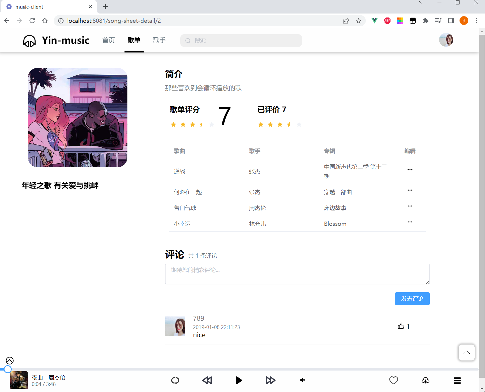


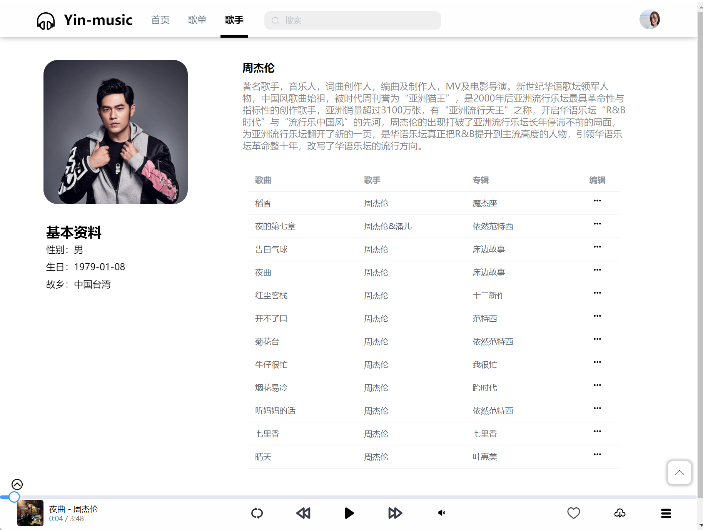

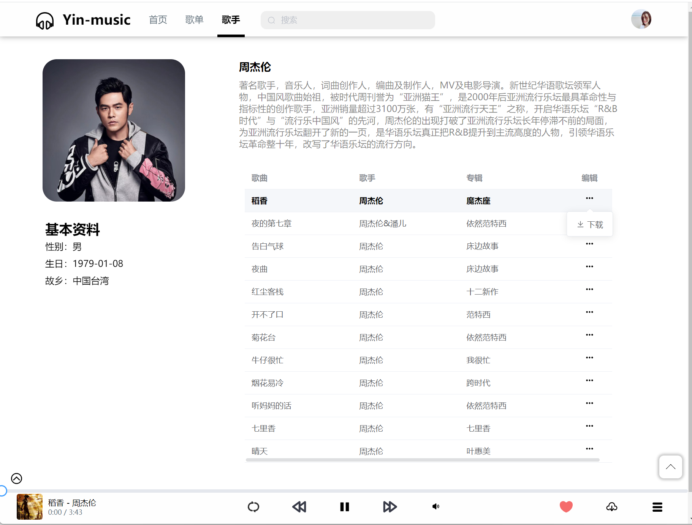

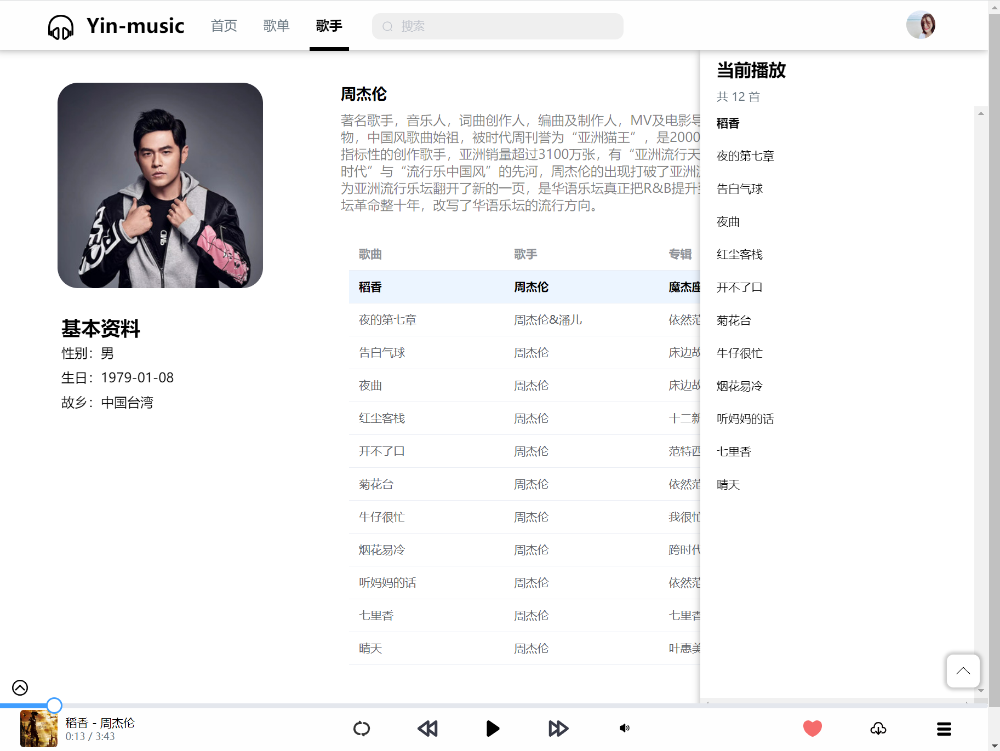

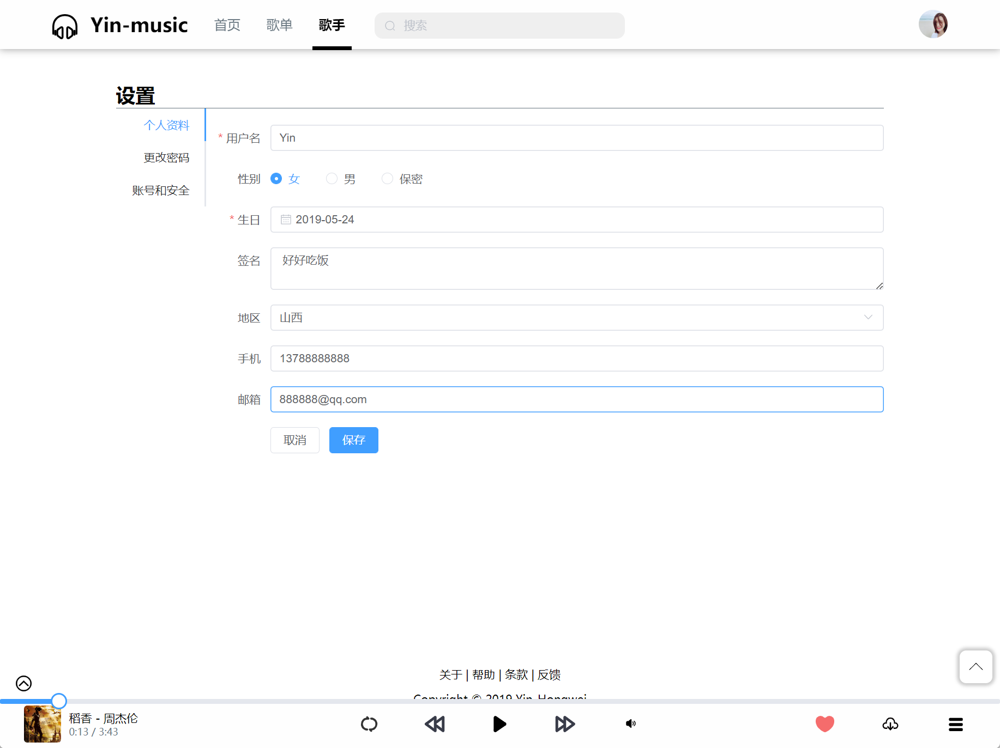

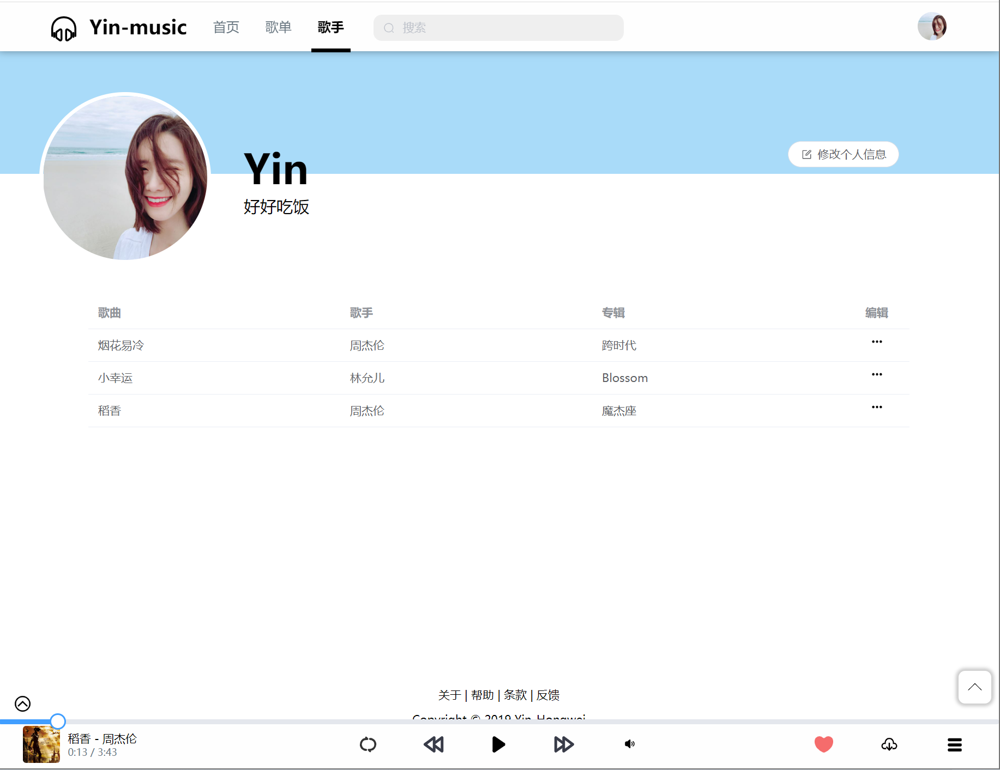

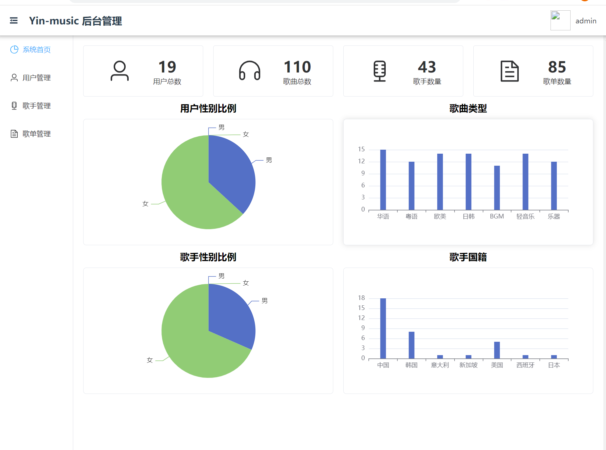

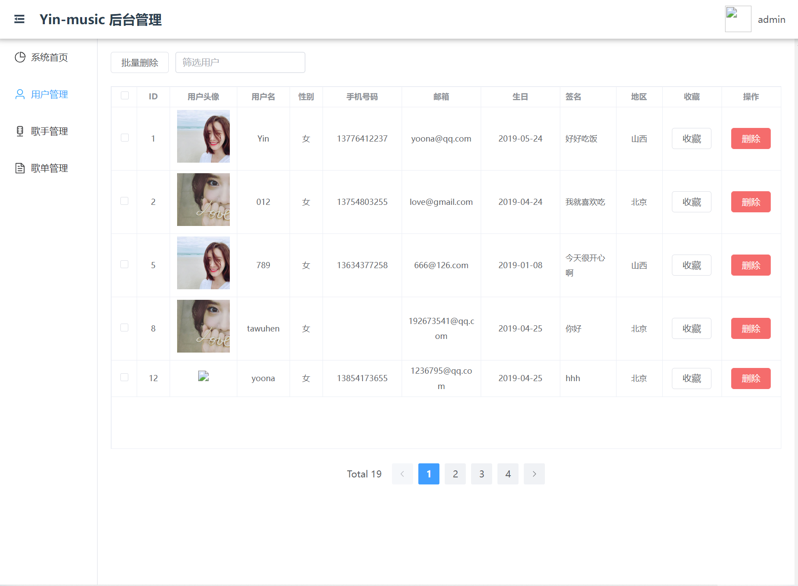

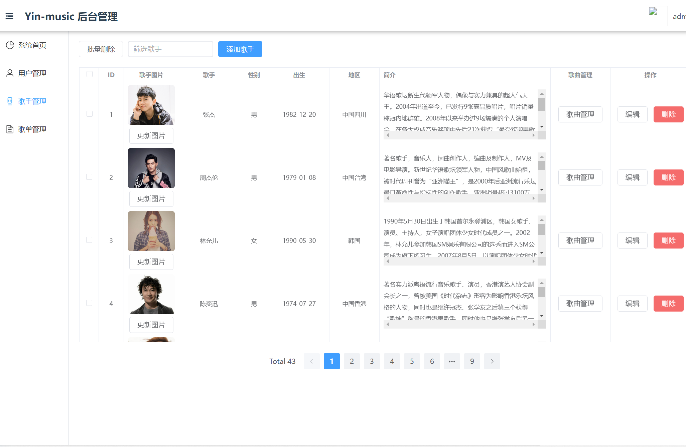

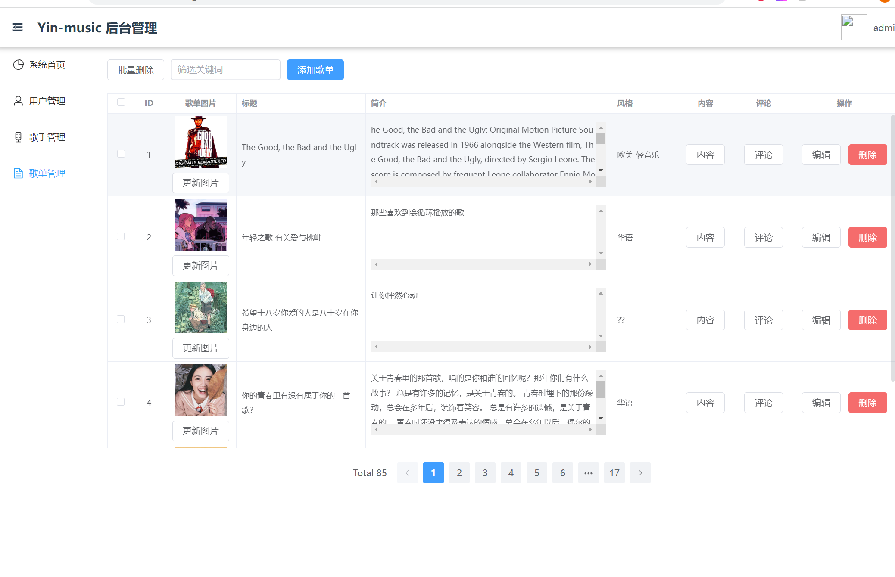

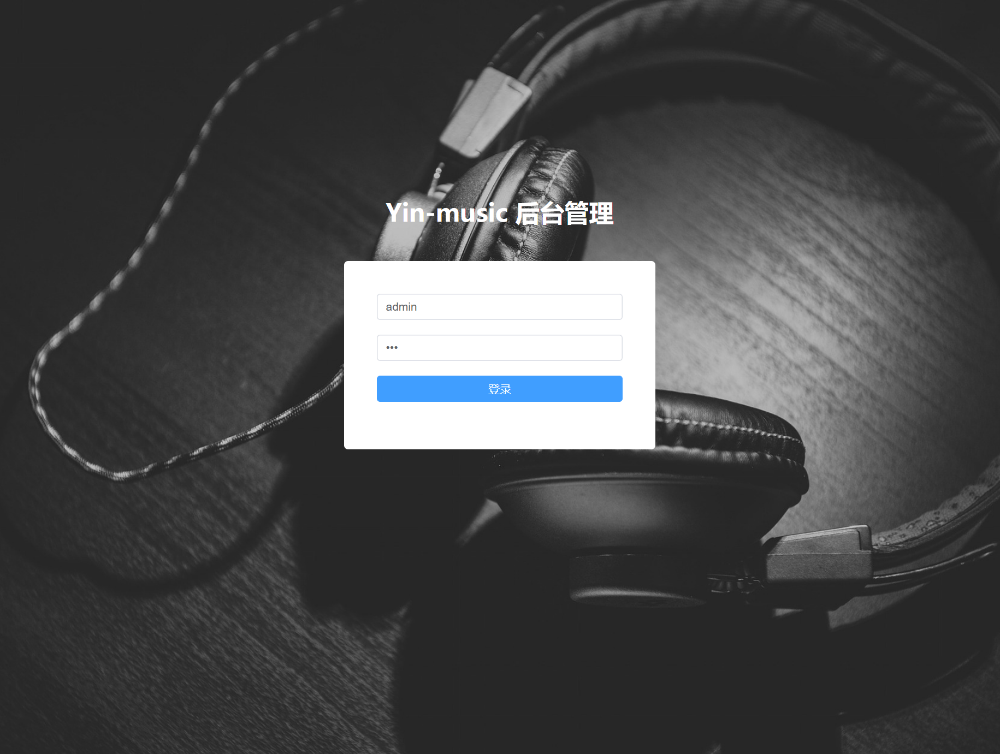

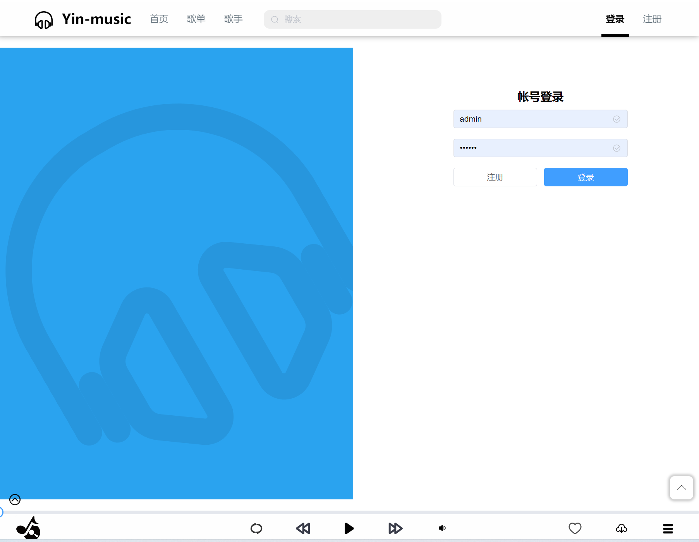

## 五、浏览地址

前端访问地址：http://localhost:8080/

用户账号/密码：Yin/123

后端地址：http://localhost:8081/

管理员账号/密码：admin/123456

## 六、安装教程

### 1、下载项目到本地

```bash

```

### 2、下载数据库中记录的资源

去【链接：https://pan.baidu.com/s/1x7JxBXSyj6ypie78b2yq7g 提取码：48yk】下载网站依赖的歌曲及图片，将 data 夹里的文件放到 music-server 文件夹下。

> 注意：资源整理了一下，按照下面的截图存放。

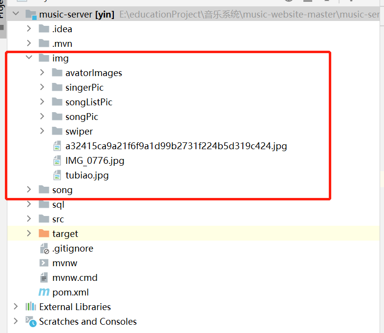

### 3、修改配置文件

1）创建数据库
将 `music-website/music-server/sql` 文件夹中的 `tp_music.sql` 文件导入数据库。

2）修改用户名密码
修改 `music-website/music-server/src/main/resources/application.properties` 文件里的 `spring.datasource.username` 和 `spring.datasource.password`；

### 4、启动项目

- **启动管理端**：进入 music-server 文件夹，运行下面命令启动服务器

```js
// 方法一
./mvnw spring-boot:run

// 方法二
mvn spring-boot:run // 前提装了 maven
```

- **启动客户端**：进入 music-client 目录，运行下面命令

```js
npm install // 安装依赖

npm run serve // 启动前台项目
```

- **启动管理端**：进入 music-manage 目录，运行下面命令

```js
npm install // 安装依赖

npm run serve // 启动后台管理项目
```

<br/>

 
